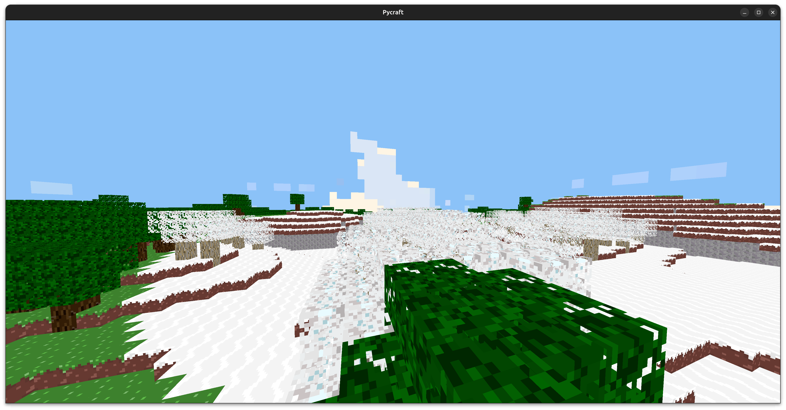

# Pycraft

This was my attempt to make a decent Minecraft clone in Python as a practice project and also as an example for my friend who is new to programming.

It has some major issues (mostly with performance and code-quality in areas) but it also has some OK parts in my opinion.


See [Installation](#Installation) for how to get this running.

I started out on this project really wanting to make it as well-written as possible for my friend. but I basically gave up once I saw how laggy the noise-sampling for the world generation was, I managed to improve the lag significantly by offloading the world generation to another Python process using `multiprocessing`, and it doesn't visibly lag spike for me anymore, but the performance is still bad, I haven't tested on a laptop but I imagine it's _really_ bad.. anyway, enjoy this half-finished, half-documented codebase!

## Good parts
- Collision system (`pycraft/physics.py`)
  - I think most voxel games/MC clones over-complicate their player-world collision. Pycraft has a very nice and simple implementation of SAT based AABB-world collision that allows the player to smoothly collide with and slide along walls. I think my code is pretty intuitive for newcomers to this type of collision system, I even put in some ASCII art :D

- Cuboid mesh generation (`Mesh` class inside of `pycraft/render.py`)
  - Most cube-producing code is just a bunch of numbers, mine is really explicit in how the different points connect to each other to form a cube, maybe this is easier to understand?

- Chunk generation (`pycraft/chunk.py`)
  - The world is divided into 16x16x16 block areas called chunks. each `Chunk` stores a 3-dimensional list of blocks and has a method called `gen_meshes` that populates a list of meshes that are used to render the `Chunk`, this method implements a basic Greedy Meshing algorithim. I think my code is alright.

- Rendering (`pycraft/render.py`)
  - Pycraft only uses two shaders: one vertex shader, one fragment shader. this was intended to simplify the rendering process. All the block textures are loaded into a TextureArray (with repeating on) and each vertex in the meshes specifies what layer of the TextureArray it should map to, and each face of the cuboids are textured individually using this. I am not claiming the way I did all this is a good solution, but it's what I ended up using and I don't think it's _that_ bad..

- Vector, Direction, Normal (`pycraft/vector.py`)
  - Like many Python MC clones, I implement my own vector class. I also have multiple "direction" enums to use in different situations. for example there's `Direction.Forward` and `Normal.Front` (I know the naming's a little weird, I was going to change but Eh!)


## Bad parts
- World generation
  - As stated previously, the noise-sampling for the world generation causes performance problems,
  there are I think 4 noise samples for each X-Z block coordinate in each chunk, and I use `opensimplex` for the noise. the `opensimplex` package appears to be pure Python, which would seem to explain the performance problems, except I tried many other noise libraries and they had similar or worse problems. (tried `noise` which is implemented in C, had same or worse performance as `opensimplex`) I also started with the `perlin-noise` package initially, and tried `pyfastnoisesimd` but couldn't get it to build properly so I gave up. and maybe some other options I've forgotten to mention.
- Gravity
  - The gravity system (which is done in `player.py` and `game.py`) has some problems with not being able to jump when on the ground sometimes, and occasionally you may fall through the ground and out of the world :)
- Lag spike when placing blocks
  - I don't know why this happens, it didn't used to happen, but it just started happening and I don't care about this project enough anymore to try and figure out what's causing it :/

# Installation
This project has the following package dependancies:
```
glfw-2.8.0
moderngl-5.12.0
pyglm-2.8.0
pillow-11.1.0
opensimplex-0.4.5.1
```
It's good practice to install per-project packages in a virtual environment instead of globally on the system.

My friend uses Windows and seems to use PowerShell, so I will attempt to give installation instructions for that. and to keep it simple (Because there seems to be some quirks of making a virtual environment with PowerShell) You could use `requirements.txt` too but I will just supply a single command that should install all the packages needed globally:
```powershell
py -m pip install glfw moderngl pyglm pillow opensimplex
```
Then, to run, simply invoke `main.py`
